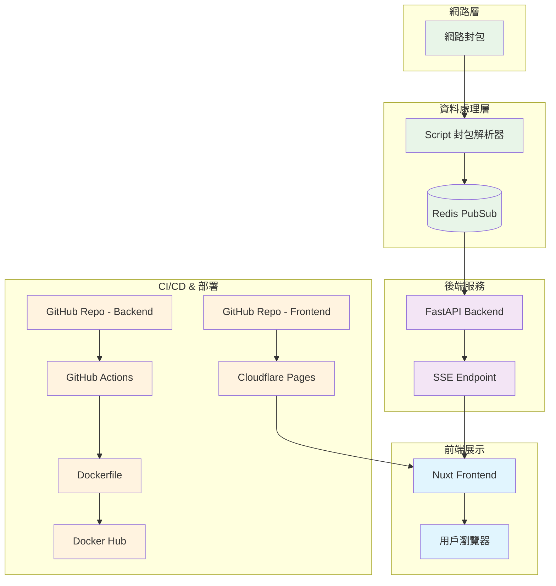

# 概覽




### 網路部署
- **後端暴露**: 使用 Cloudflare Tunnel
- **部署環境**: Docker Compose 在 Proxmox VM 上

### 封包分析流程
1. **封包捕獲**: 使用 [mitmproxy](https://mitmproxy.org/) 抓取楓之谷 Artale 的網路封包
2. **協議確認**: 透過 Wireshark 驗證，確認遊戲使用 WebSocket (`/ws` 端點) 進行通訊
3. **封包解析策略**: 
   - 初期嘗試固定欄位固定長度解析
   - 後改用欄位名稱搜尋方法解析內容

### 架構設計

#### 背景問題

##### 1. 資料來源與部署環境分離
- **資料來源**: Windows VM 環境
- **後端服務**: Linux 環境  
- **問題**: 兩個環境分離，需要建立資料傳輸橋樑

##### 2. 多 Worker 架構下的資料一致性
- **原始想法**: 直接從 VM 推送資料到後端
- **遇到問題**: 多 worker 環境下無法保證每個用戶連線都能接收到相同的資料
- **影響**: 用戶體驗不一致，資料同步問題

#### 解決方案

##### 核心策略：Redis PubSub 作為資料中繼層

````plaintext
Windows VM (封包捕獲) 
    ↓ 
Redis PubSub (資料佇列)
    ↓
FastAPI Workers (多個實例)
    ↓
SSE 連線 (即時推送)
    ↓
前端用戶 (一致的資料體驗)
````


### 現有資源
- **封包範例**: 
  - [Packet1](https://github.com/virgil724/maplestory/blob/master/old-packet.txt)
  - [Packet2](https://github.com/virgil724/maplestory/blob/master/new-packet.txt)
- **結構文檔**: [封包結構說明](https://github.com/virgil724/maplestory/blob/master/packet_structure.md) - 包含偏移量資訊
- 捕獲封包過程

